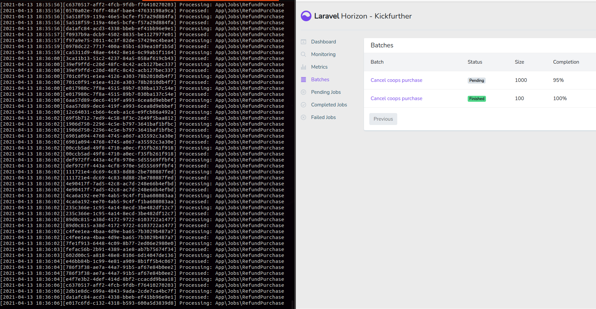

## Install

Normal laravel installation, just run `composer install` and adjust variables on `.env` file.

## Migration
Run migrations executing `php artisan migrate`

## Seeding
I think seeders must be prepared to simulate a little bit of the registers the company has in DB. Run seeders with `php artisan db:seed`. The console will ask for some user input, like how many registers should be created, etc.

## kf:cancel-coops (command)

> This is my solution proposed to the main requirement.

I've create this command to simulate how to cancel many coops automatically. It can receive one of the following parameters:

- --coop={coopId}, to cancel just the given coop. If the coop has been fully funded, it won't be cancelled
- --date={Y-m-d}, to cancel all coops that has not been fully funded and expires in the given date

> Of course, this command should be executed automatically by the crontab from the OS, using the Laravel task scheduler (check `app/Console/Kernel.php`, it is already configured).

Important: if the command doesn't receive any parameter, it will cancel all coops expiring in the current date (today).

The command will queue a batch of jobs, and at the end dispatch the notification to each coop's owner. If there are a lot of coops in DB, it is recommended to use `MAIL_MAILER=log`, this way we don't really receive an exception from the mail provider (like Mailtrap, for example).

## Horizon
I wanted to simulate the process to refund ~1000 purchases, so I've installed horizon to monitor a batch of jobs.

Please, make sure to use `redis` as queue driver to check this.

## Tests
There are many tests for some edge cases, like seeing only coops in draft and refunding each purchase successfully.

## Docker
The app has been tested on valet and docker, using sail.
